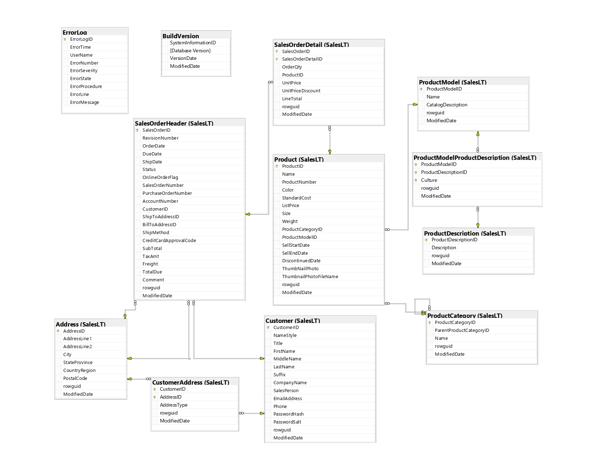

# Este guia é um **playbook de Análise de Dados com SQL**, organizado em 4 fases:

1- Data cleaning  
2- Data exploration  
3- Data analysis  
4- Descobertas / insights  

No final, há uma lista de **relatórios sugeridos** para transformar as análises em entrega de negócio.

Banco recomendado para prática: **AdventureWorksLT (Azure SQL)** (schema `SalesLT`).


---

## Como usar este guia

- Configure o ambiente [Setup](../1-setup/README.md)
- Use conecte via [SSMS](../1-setup/ssms.md) ou [VSCode](../1-setup/vscode.md)
- Copie a query do tópico que você precisa e cole onde estiver conectado acima no BD.
- Ajuste o `WHERE` para seu recorte (período, categoria, cliente, etc.).
- Execute por etapas (valide cada bloco).
- Se fizer DML/DDL em laboratório, use **TRANSACTION + ROLLBACK**.
- Para entender a lógica da query consulte [comandos sql](../2-scripts-tutorial-sql-guiado)

↳ Use este README como uma “biblioteca de queries” para projetos de BI/Analytics.

---

# 1- Data cleaning (limpeza e padronização)

A etapa de *cleaning* em SQL normalmente envolve:
- tratar `NULL`
- padronizar texto (maiúsculas/minúsculas, espaços)
- validar chaves e relacionamentos
- checar duplicidades
- criar flags de qualidade

## 1.1 Contando qtd de registros nulos na coluna (Customer)
```sql
-- A ideia é contar apenas se o valor no registor é NULL

SELECT
  SUM(CASE WHEN EmailAddress IS NULL THEN 1 ELSE 0 END) AS EmailNulo,
  SUM(CASE WHEN FirstName IS NULL THEN 1 ELSE 0 END) AS FirstNameNulo,
  SUM(CASE WHEN LastName  IS NULL THEN 1 ELSE 0 END) AS LastNameNulo
FROM SalesLT.Customer;
```

## 1.2 Flag de qualidade (Customer)
```sql
-- se os dados não estão são completos, retorno como Inconsistente

SELECT TOP 100
  CustomerID,
  FirstName,
  LastName,
  EmailAddress,
  CASE
    WHEN EmailAddress IS NULL OR FirstName IS NULL OR LastName IS NULL THEN 'Inconsistente'
    ELSE 'OK'
  END AS StatusQualidade
FROM SalesLT.Customer
ORDER BY CustomerID;
```
## 1.3 Padronização de texto (TRIM + UPPER + CONCAT)
```sql
-- Padroniza para maiúscula e concatena nome com sobrenome

SELECT TOP 100
  CustomerID,
  UPPER(LTRIM(RTRIM(FirstName))) AS FirstName_Padronizado,
  UPPER(LTRIM(RTRIM(LastName)))  AS LastName_Padronizado,
  CONCAT(LTRIM(RTRIM(FirstName)), ' ', LTRIM(RTRIM(LastName))) AS NomeCompleto
FROM SalesLT.Customer;
```

## 1.4 Duplicidade lógica (ex: e-mails repetidos)
```sql
SELECT
  EmailAddress,
  COUNT(*) AS Qtd
FROM SalesLT.Customer
WHERE EmailAddress IS NOT NULL
GROUP BY EmailAddress
HAVING COUNT(*) > 1
ORDER BY Qtd DESC;
```

## 1.5 Integridade (pedido com cliente inexistente)
```sql
SELECT TOP 50
  soh.SalesOrderID,
  soh.CustomerID
FROM SalesLT.SalesOrderHeader soh
LEFT JOIN SalesLT.Customer c
  ON c.CustomerID = soh.CustomerID
WHERE c.CustomerID IS NULL;
```

## 1.6 Evitar divisão por zero (NULLIF)
```sql
SELECT
  1.0 * SUM(OrderQty) / NULLIF(COUNT(DISTINCT SalesOrderID), 0) AS MediaItensPorPedido
FROM SalesLT.SalesOrderDetail;
```

# 2- Data exploration (descobertas)
Aqui você responde:

- O que existe nos dados?

- Como está distribuído?

- Quais são as principais dimensões?

## 2.1 Tamanho e volume
```sql
Copiar código
SELECT
  (SELECT COUNT(*) FROM SalesLT.Customer)        AS TotalClientes,
  (SELECT COUNT(*) FROM SalesLT.SalesOrderHeader) AS TotalPedidos,
  (SELECT COUNT(*) FROM SalesLT.SalesOrderDetail) AS TotalItens;
  ``` 
## 2.2 Intervalo de datas
```sql
Copiar código
SELECT
  MIN(OrderDate) AS PrimeiroPedido,
  MAX(OrderDate) AS UltimoPedido
FROM SalesLT.SalesOrderHeader;
  ``` 
2.3 Distintos (ex: cores)
```sql
Copiar código
SELECT DISTINCT Color
FROM SalesLT.Product
WHERE Color IS NOT NULL
ORDER BY Color;
  ``` 
## 2.4 Distribuição por categoria (quantidade de produtos)
```sql
Copiar código
SELECT
  ProductCategoryID,
  COUNT(*) AS QtdProdutos
FROM SalesLT.Product
GROUP BY ProductCategoryID
ORDER BY QtdProdutos DESC;
  ``` 
## 2.5 Top produtos mais caros (faixa de preço)
```sql
Copiar código
SELECT TOP 10
  ProductID,
  Name,
  ListPrice
FROM SalesLT.Product
ORDER BY ListPrice DESC;
  ``` 
## 3- Data analysis (métricas, KPIs e análises)
Aqui você responde:

Quanto vendemos?

Quem compra mais?

Quais produtos performam melhor?

Como evolui no tempo?

## 3.1 KPI: faturamento total e ticket médio
```sql
Copiar código
-- Faturamento total (detalhe)
SELECT SUM(LineTotal) AS FaturamentoTotal
FROM SalesLT.SalesOrderDetail;

-- Ticket médio (header)
SELECT AVG(SubTotal) AS TicketMedio
FROM SalesLT.SalesOrderHeader;
  ``` 
## 3.2 Faturamento por período (Ano/Mês)
```sql
SELECT
  YEAR(OrderDate)  AS Ano,
  MONTH(OrderDate) AS Mes,
  SUM(SubTotal)    AS Faturamento
FROM SalesLT.SalesOrderHeader
GROUP BY YEAR(OrderDate), MONTH(OrderDate)
ORDER BY Ano, Mes;
```
## 3.3 Top clientes por faturamento
```sql
SELECT TOP 10
  c.CustomerID,
  CONCAT(c.FirstName, ' ', c.LastName) AS Cliente,
  SUM(soh.SubTotal) AS FaturamentoTotal
FROM SalesLT.Customer c
INNER JOIN SalesLT.SalesOrderHeader soh
  ON soh.CustomerID = c.CustomerID
GROUP BY c.CustomerID, c.FirstName, c.LastName
ORDER BY FaturamentoTotal DESC;
```
## 3.4 Top produtos por quantidade vendida
```sql
SELECT TOP 10
  p.ProductID,
  p.Name,
  SUM(sod.OrderQty) AS QtdVendida
FROM SalesLT.SalesOrderDetail sod
INNER JOIN SalesLT.Product p
  ON p.ProductID = sod.ProductID
GROUP BY p.ProductID, p.Name
ORDER BY QtdVendida DESC;
```
## 3.5 Descontos: total e classificação
```sql
-- Total concedido em desconto
SELECT
  SUM(UnitPrice * UnitPriceDiscount * OrderQty) AS DescontoTotal
FROM SalesLT.SalesOrderDetail;

-- Classificação por item
SELECT TOP 50
  SalesOrderID,
  ProductID,
  OrderQty,
  UnitPrice,
  UnitPriceDiscount,
  CASE
    WHEN UnitPriceDiscount > 0 THEN 'Com desconto'
    ELSE 'Sem desconto'
  END AS TipoDesconto
FROM SalesLT.SalesOrderDetail
ORDER BY SalesOrderID;
```
## 3.6 Clientes inativos (último pedido > 365 dias)
```sql
WITH ult AS (
  SELECT CustomerID, MAX(OrderDate) AS UltimoPedido
  FROM SalesLT.SalesOrderHeader
  GROUP BY CustomerID
)
SELECT
  CustomerID,
  UltimoPedido,
  DATEDIFF(day, UltimoPedido, GETDATE()) AS DiasSemComprar
FROM ult
WHERE DATEDIFF(day, UltimoPedido, GETDATE()) > 365
ORDER BY DiasSemComprar DESC;
```
## 3.7 Ranking por cliente (Window Function)
```sql
Copiar código
SELECT
  CustomerID,
  SalesOrderID,
  OrderDate,
  ROW_NUMBER() OVER (
    PARTITION BY CustomerID
    ORDER BY OrderDate DESC, SalesOrderID DESC
  ) AS RankPedidoRecente
FROM SalesLT.SalesOrderHeader
ORDER BY CustomerID, RankPedidoRecente;
```
# 4- Descobertas / Insights (perguntas que geram ação)
Nesta fase, você transforma métricas em oportunidades e recomendações.

## 4.1 Segmentação de clientes por faturamento
```sql
Copiar código
WITH fat AS (
  SELECT
    c.CustomerID,
    SUM(soh.SubTotal) AS FaturamentoTotal
  FROM SalesLT.Customer c
  LEFT JOIN SalesLT.SalesOrderHeader soh
    ON soh.CustomerID = c.CustomerID
  GROUP BY c.CustomerID
)
SELECT
  CustomerID,
  COALESCE(FaturamentoTotal, 0) AS FaturamentoTotal,
  CASE
    WHEN COALESCE(FaturamentoTotal, 0) = 0 THEN 'Sem compras'
    WHEN FaturamentoTotal < 1000 THEN 'Baixo'
    WHEN FaturamentoTotal BETWEEN 1000 AND 5000 THEN 'Médio'
    ELSE 'Alto'
  END AS Segmento
FROM fat
ORDER BY FaturamentoTotal DESC;
```
## 4.2 Produtos “caros e encalhados” (alto preço, baixa venda)
```sql

WITH vendas AS (
  SELECT
    p.ProductID,
    p.Name,
    p.ListPrice,
    COALESCE(SUM(sod.OrderQty), 0) AS QtdVendida
  FROM SalesLT.Product p
  LEFT JOIN SalesLT.SalesOrderDetail sod
    ON sod.ProductID = p.ProductID
  GROUP BY p.ProductID, p.Name, p.ListPrice
)
SELECT TOP 20 *
FROM vendas
WHERE ListPrice >= 500
ORDER BY QtdVendida ASC, ListPrice DESC;
```
## 4.3 Anomalias simples (pedidos muito acima do padrão)
```sql
WITH stats AS (
  SELECT AVG(SubTotal) AS Media, STDEV(SubTotal) AS Desvio
  FROM SalesLT.SalesOrderHeader
)
SELECT TOP 50
  soh.SalesOrderID,
  soh.CustomerID,
  soh.OrderDate,
  soh.SubTotal
FROM SalesLT.SalesOrderHeader soh
CROSS JOIN stats s
WHERE soh.SubTotal > s.Media + (3 * s.Desvio)
ORDER BY soh.SubTotal DESC;
```

# Relatórios sugeridos (entregáveis de negócio)
💡Depois de rodar as análises, transforme em relatórios.

## 1- Visão Executiva (KPIs)
Faturamento total

- Ticket médio

- Total de pedidos

- Total de clientes

- Desconto total concedido

## 2- Vendas no tempo
Faturamento por ano/mês

- Quantidade de pedidos por ano/mês

- Comparativo MoM (mês contra mês)

## 3- Clientes (segmentação e retenção)
- Top clientes por faturamento

- Clientes sem compras

- Clientes inativos (último pedido > 365 dias)

- Segmentação (Sem compras / Baixo / Médio / Alto)

## 4- Produtos (portfólio e performance)
- Produtos mais vendidos (qtd e receita)

- Produtos sem venda

- Produtos caros com baixa venda

- Análise de descontos por produto/categoria

## 5- Qualidade de dados
- Campos críticos nulos

- Duplicidades (e-mail / chaves de negócio)

- Pedidos sem cliente (integridade)

# Como usar
- Configure o ambiente real [Setup](../1-setup/README.md)
- Conecte no Banco com [SSMS](../1-setup/ssms.md) ou [VSCode](../1-setup/vscode.md)
- Copie as querys e execute , estudando o resultado e comando

# Conclusão
Este guia serve como uma introdução de SQL para analistas de dados, limpeza de dados, análise exploratória de dados e consultas SQL orientadas a negócios. As descobertas aqui podem ajudar em decisões do negócios, assim a compreensão de padrões e comportamento do cliente e desempenho do produtos.

# Autor - Fabio Marçolia | Carreira em Dados & IA

Para mais conteúdo de SQL, Dados e IA ou se quiser falar comigo ou feedback desse conteúdo👇

🔗 http://linkedin.com/in/fabiomarcolia

Agradeço e vamos nos conectar no Linkedin!


